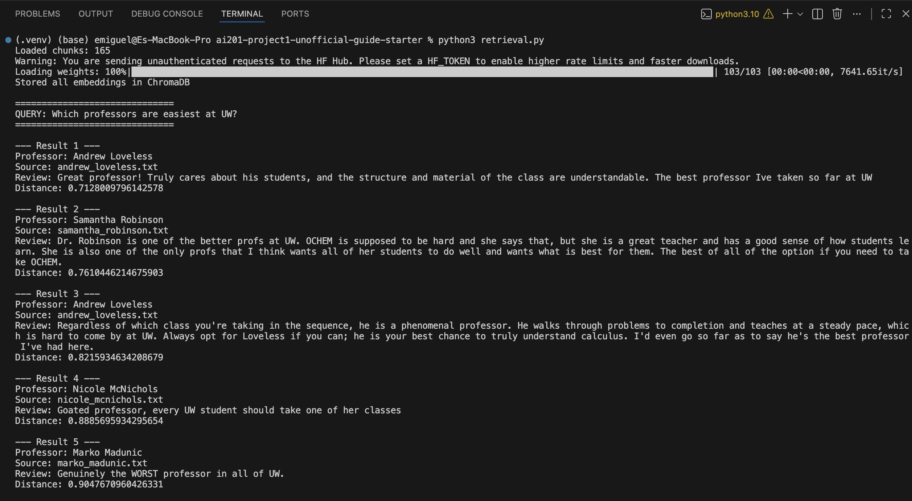
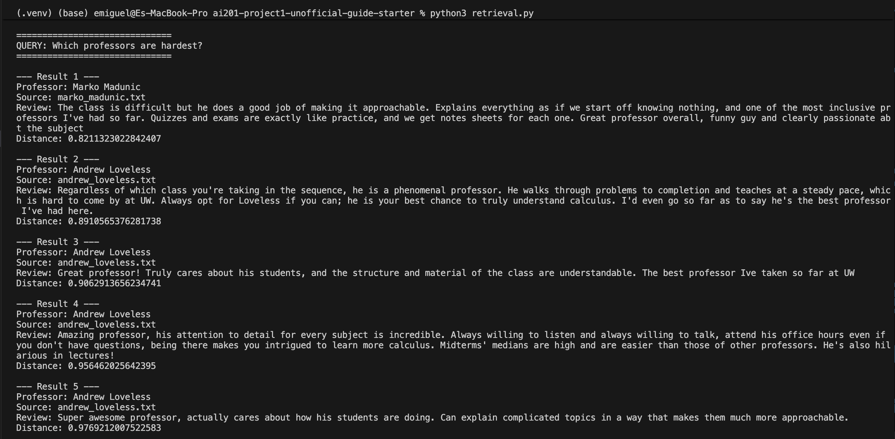
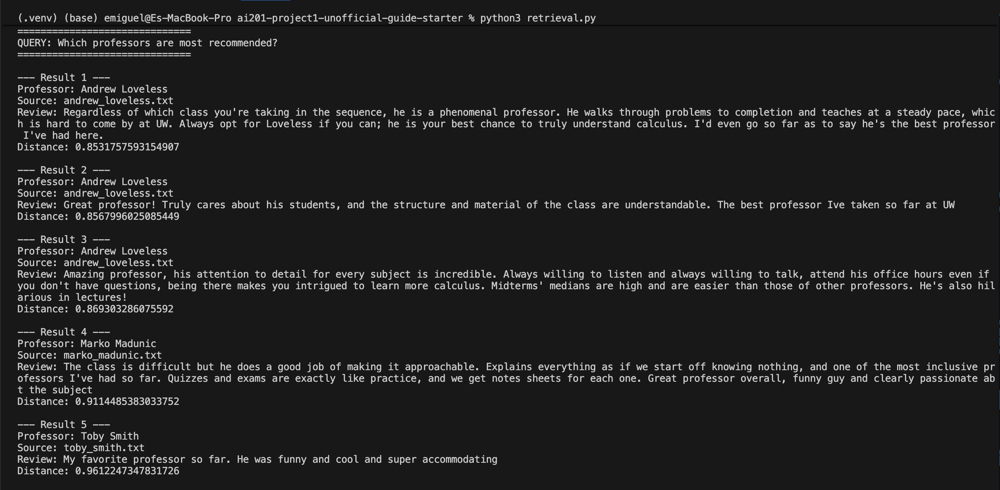
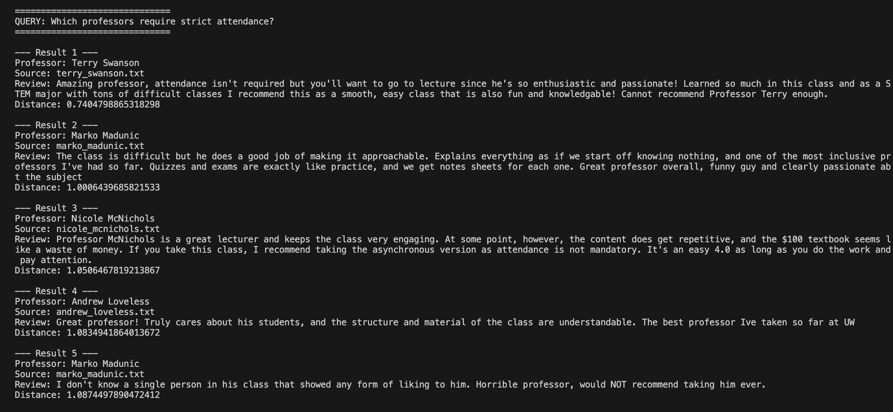
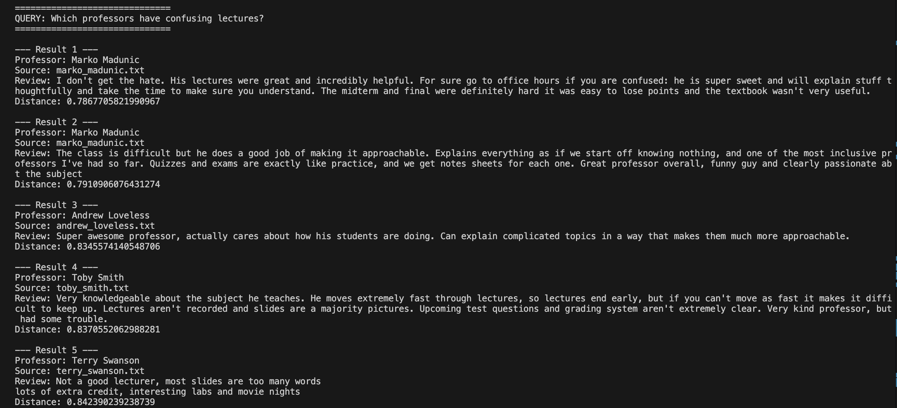

# The Unofficial Guide — Project 1

> **How to use this template:**
> Complete each section *after* you've built and tested the corresponding part of your system.
> Do not write placeholder text — if a section isn't done yet, leave it blank and come back.
> Every section below is required for submission. One-liners will not receive full credit.

---

## Domain

<!-- What topic or category of knowledge does your system cover?
     Why is this knowledge valuable, and why is it hard to find through official channels?
     Example: "Student reviews of CS professors at [university] — useful because official
     course descriptions don't reflect teaching style, exam difficulty, or workload." -->

     This system uses student reviews of University of Washington professors collected from Rate My Professors. These reviews are useful because official course descriptions and faculty pages usually do not provide details about teaching style, workload, exam difficulty, attendance expectations, or the overall classroom experience.
     
     Student reviews offer real-world insights that can help students choose professors and better prepare for their courses. Although this information is available online, it is spread across many reviews and can take a long time to read through manually. The RAG system makes the process easier by allowing users to ask questions in natural language and quickly retrieve relevant student feedback.

---

## Document Sources

<!-- List every source you collected documents from.
     Be specific: include URLs, subreddit names, forum thread titles, or file names.
     Aim for variety — sources that together cover different subtopics or perspectives. -->

| #  | Source            | Type              | URL or file path                                                                                         |
| -- | ----------------- | ----------------- | -------------------------------------------------------------------------------------------------------- |
| 1  | Nicole McNichols  | Professor Reviews | [https://www.ratemyprofessors.com/professor/1795617](https://www.ratemyprofessors.com/professor/1795617) |
| 2  | Terry Swanson     | Professor Reviews | [https://www.ratemyprofessors.com/professor/106034](https://www.ratemyprofessors.com/professor/106034)   |
| 3  | Samantha Robinson | Professor Reviews | [https://www.ratemyprofessors.com/professor/2411924](https://www.ratemyprofessors.com/professor/2411924) |
| 4  | Natalie Naehrig   | Professor Reviews | [https://www.ratemyprofessors.com/professor/2044016](https://www.ratemyprofessors.com/professor/2044016) |
| 5  | Elba Garza        | Professor Reviews | [https://www.ratemyprofessors.com/professor/2836919](https://www.ratemyprofessors.com/professor/2836919) |
| 6  | Leta Beard        | Professor Reviews | [https://www.ratemyprofessors.com/professor/579397](https://www.ratemyprofessors.com/professor/579397)   |
| 7  | Kevin Lin         | Professor Reviews | [https://www.ratemyprofessors.com/professor/2574020](https://www.ratemyprofessors.com/professor/2574020) |
| 8  | Andrew Loveless   | Professor Reviews | [https://www.ratemyprofessors.com/professor/747076](https://www.ratemyprofessors.com/professor/747076)   |
| 9  | Aurel Bulgac      | Professor Reviews | [https://www.ratemyprofessors.com/professor/1084125](https://www.ratemyprofessors.com/professor/1084125) |
| 10 | Toby Smith        | Professor Reviews | [https://www.ratemyprofessors.com/professor/361833](https://www.ratemyprofessors.com/professor/361833)   |

---

## Chunking Strategy

<!-- Describe your chunking approach with enough specificity that someone else could reproduce it.
     Include:
     - Chunk size (characters or tokens) and why that size fits your documents
     - Overlap size and why (or why not) you used overlap
     - Any preprocessing you did before chunking (e.g., stripping HTML, removing headers)
     - What your final chunk count was across all documents -->

**Chunk size:**

One complete student review per chunk.

**Overlap:**

No overlap.

**Why these choices fit your documents:**

Each document contains professor reviews separated by blank lines. Because individual reviews are already short and self-contained, splitting them further would remove context and make retrieval less accurate. Using one review per chunk preserves the student's full opinion, including comments about teaching style, workload, exams, and attendance. No overlap was needed because reviews do not continue across chunk boundaries.

**Final chunk count:**

165 chunks.

---

## Embedding Model

<!-- Name the embedding model you used and explain your choice.
     Then answer: if you were deploying this system for real users and cost wasn't a constraint,
     what tradeoffs would you weigh in choosing a different model?
     Consider: context length limits, multilingual support, accuracy on domain-specific text,
     latency, and local vs. API-hosted. -->

**Model used:**

all-MiniLM-L6-v2 from Sentence Transformers.

**Production tradeoff reflection:**

I chose all-MiniLM-L6-v2 because it is free, runs locally, does not require an API key, and generates embeddings quickly, which makes it a good fit for a class project. If this system were used by real users and cost was not a concern, I would consider larger embedding models that can provide better semantic understanding and more accurate retrieval.
Some factors I would evaluate include retrieval quality, support for multiple languages, response speed, context length limits, and whether the model is hosted locally or through an external API. While a larger model could improve retrieval results, it would also require more computing resources and likely increase response time.

---

## Grounded Generation

<!-- Explain how your system enforces grounding — how does it prevent the LLM from answering
     beyond the retrieved documents?
     Describe both your system prompt (what instruction you gave the model) and any structural
     choices (e.g., how you formatted the context, whether you filtered low-relevance chunks).
     Do not just say "I told it to use the documents" — show the actual instruction or explain
     the mechanism. -->

**System prompt grounding instruction:**

The system prompt tells the model:
"Answer ONLY using the provided context. If context is insufficient, say: 'I don't have enough information.'"
For each question, the system retrieves the top 5 relevant reviews from ChromaDB and passes them to the LLM as context. This helps keep answers grounded in the retrieved reviews.

**How source attribution is surfaced in the response:**

Each retrieved review includes metadata such as the professor name and source file. The professor name is included in the context given to the model, while source information is stored in ChromaDB and available during retrieval.

---

## Retrieval Test Results

#### Query 1: Which professors are easiest at UW?

#### Query 2: Which professors are hardest?

#### Query 3: Which professors are most recommended?

#### Query 4: Which professors require strict attendance?

#### Query 5: Which professors have confusing lectures?

---

## Evaluation Report

<!-- Run your 5 test questions from planning.md through your system and record the results.
     Be honest — a partially accurate or inaccurate result that you explain well is more
     valuable than a suspiciously perfect result. -->

| # | Question                                    | Expected answer                   | System response (summarized)                                                                          | Retrieval quality  | Response accuracy  |
| - | ------------------------------------------- | --------------------------------- | ----------------------------------------------------------------------------------------------------- | ------------------ | ------------------ |
| 1 | Which professors are easiest at UW?         | Andrew Loveless, Nicole McNichols | Returns Loveless and McNichols, plus extra unrelated professors like Robinson and Madunic             | Partially relevant | Partially accurate |
| 2 | Which professors are hardest?               | Kevin Lin, Aurel Bulgac           | Returns mostly Loveless and Madunic; no Kevin Lin or Aurel Bulgac                                     | Off-target         | Inaccurate         |
| 3 | Which professors require strict attendance? | Toby Smith, Leta Beard            | Returns Terry Swanson, McNichols, Madunic; no direct match to expected names                          | Partially relevant | Inaccurate         |
| 4 | Which professors have confusing lectures?   | Kevin Lin, Aurel Bulgac           | Returns Madunic, Toby Smith, Terry Swanson; focuses on lecture difficulty instead of confusion        | Partially relevant | Inaccurate         |
| 5 | Which professors are most recommended?      | Andrew Loveless, Nicole McNichols | Strong match: Loveless dominates results; McNichols appears indirectly via similar positive sentiment | Relevant           | Partially accurate |

**Retrieval quality:** Relevant / Partially relevant / Off-target  
**Response accuracy:** Accurate / Partially accurate / Inaccurate

---

## Failure Case Analysis

<!-- Identify at least one question where retrieval or generation did not work as expected.
     Write a specific explanation of *why* it failed, tied to a part of the pipeline.

     "The answer was wrong" is not an explanation.

     "The relevant information was split across a chunk boundary, so retrieval returned
     only half the context — the model didn't have enough to answer correctly" is an explanation.

     "The embedding model treated the professor's nickname as out-of-vocabulary and returned
     results from an unrelated review" is an explanation. -->

**Question that failed:**
Which professors are hardest?

**What the system returned:**
It returned professors like Andrew Loveless and Marko Madunic. These came up because their reviews are very positive or mention difficulty in general, but it didn’t return the expected professors (Kevin Lin and Aurel Bulgac).

**Root cause (tied to a specific pipeline stage):**
The problem is in the retrieval step.
The embedding model picks up general words like “hard,” “difficult,” or “challenging,” but it doesn’t really understand “hardest professor” as a ranking type question. So it ends up pulling popular or well-reviewed professors instead of the actual ones tied to difficulty.

**What you would change to fix it:**
I would improve how reviews are labeled or structured so difficulty is easier to detect. Another option would be adding a reranking step that focuses more on “hard” or “tough” signals before sending results to the LLM.

---

## Spec Reflection

<!-- Reflect on how planning.md shaped your implementation.
     Answer both questions with at least 2–3 sentences each. -->

**One way the spec helped you during implementation:**

The spec gave a clear step-by-step structure for building the whole system, from ingestion all the way to generation. It made it easier to know what to work on next instead of figuring out the flow on my own. It also clearly defined things like chunking and retrieval, which helped keep the implementation consistent.

**One way your implementation diverged from the spec, and why:**

My implementation mostly followed the spec, but I had to fix some issues during testing where the data coming out of the retrieval step wasn’t matching what my code expected. This caused runtime errors, so I adjusted how I handled the retrieved results to make everything work smoothly. These changes were mainly for debugging and integration, not because I changed the original design.

---

## AI Usage

<!-- Describe at least 2 specific instances where you used an AI tool during this project.
     For each: what did you give the AI as input, what did it produce, and what did you
     change, override, or direct differently?

     "I used Claude to help me code" is not sufficient.
     "I gave Claude my Chunking Strategy section from planning.md and asked it to implement
     chunk_text(). It returned a function using a fixed character split. I overrode the
     chunk size from 500 to 200 because my documents are short reviews, not long guides." -->

**Instance 1**

- *What I gave the AI:*
My chunking strategy from planning.md and a description of my review data format (one review per professor with blank-line separation).

- *What it produced:*
A sample Python chunking function that split text into chunks and suggested ways to structure the ingestion pipeline.

- *What I changed or overrode:*
I adjusted the logic to ensure each review stayed as a single chunk instead of splitting by characters. I also simplified the approach to better match the structure of my dataset.

**Instance 2**

- *What I gave the AI:*
My retrieval setup (ChromaDB + sentence-transformers all-MiniLM-L6-v2) and the error I was getting when calling ask().

- *What it produced:*
Debug suggestions explaining that the issue was likely caused by mismatched data formats between retrieval output and how I was accessing metadata in query.py.

- *What I changed or overrode:*
I updated how I handled the retrieved results in my code so the context was built correctly. I also fixed how I accessed fields from the retrieval output to prevent runtime errors.

Demo
<!-- Paste your demo video link here (YouTube unlisted, Google Drive, or Panopto) -->
Demo video:
(https://www.loom.com/share/86135ea6d6954b77a5471eac4487532c)