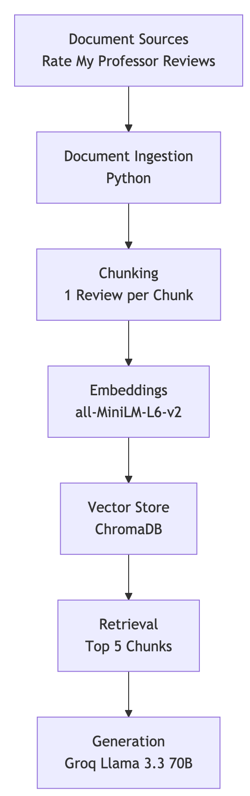

# Project 1 Planning: The Unofficial Guide

> Write this document before you write any pipeline code.
> Your spec and architecture diagram are what you'll use to direct AI tools (Claude, Copilot, etc.) to generate your implementation — the more specific they are, the more useful the generated code will be.
> Update the Retrieval Approach and Chunking Strategy sections if you change your approach during implementation.
> Update this file before starting any stretch features.

---

## Domain

<!-- What domain did you choose? Why is this knowledge valuable and hard to find through official channels? -->

I am building a retrieval system for University of Washington professor reviews collected from Rate My Professor. My system allows students to search real student feedback about teaching quality, grading difficulty, workload, and lecture style.

This knowledge is valuable because official university pages do not include real student experiences. These reviews are scattered, unstructured, and difficult to search manually, which makes it hard for students to compare professors effectively.

---

## Documents

<!-- List your specific sources: URLs, subreddit names, forum threads, or file descriptions.
     Aim for at least 10 sources that together cover different subtopics or perspectives within your domain. -->

| #  | Source            | Description          | URL or location                                                                                          |
| -- | ----------------- | -------------------- | -------------------------------------------------------------------------------------------------------- |
| 1  | Nicole McNichols  | UW professor reviews | [https://www.ratemyprofessors.com/professor/1795617](https://www.ratemyprofessors.com/professor/1795617) |
| 2  | Terry Swanson     | UW professor reviews | [https://www.ratemyprofessors.com/professor/106034](https://www.ratemyprofessors.com/professor/106034)   |
| 3  | Samantha Robinson | UW professor reviews | [https://www.ratemyprofessors.com/professor/2411924](https://www.ratemyprofessors.com/professor/2411924) |
| 4  | Natalie Naehrig   | UW professor reviews | [https://www.ratemyprofessors.com/professor/2044016](https://www.ratemyprofessors.com/professor/2044016) |
| 5  | Elba Garza        | UW professor reviews | [https://www.ratemyprofessors.com/professor/2836919](https://www.ratemyprofessors.com/professor/2836919) |
| 6  | Leta Beard        | UW professor reviews | [https://www.ratemyprofessors.com/professor/579397](https://www.ratemyprofessors.com/professor/579397)   |
| 7  | Kevin Lin         | UW professor reviews | [https://www.ratemyprofessors.com/professor/2574020](https://www.ratemyprofessors.com/professor/2574020) |
| 8  | Andrew Loveless   | UW professor reviews | [https://www.ratemyprofessors.com/professor/747076](https://www.ratemyprofessors.com/professor/747076)   |
| 9  | Aurel Bulgac      | UW professor reviews | [https://www.ratemyprofessors.com/professor/1084125](https://www.ratemyprofessors.com/professor/1084125) |
| 10 | Toby Smith        | UW professor reviews | [https://www.ratemyprofessors.com/professor/361833](https://www.ratemyprofessors.com/professor/361833)   |

---

## Chunking Strategy

<!-- How will you split documents into chunks?
     State your chunk size (in tokens or characters), overlap size, and explain why those
     numbers fit the structure of your documents.
     A review-heavy corpus warrants different chunking than a long FAQ. -->
     

**Chunk size:**
I will use 1 review per chunk (approximately 200–400 tokens)

**Overlap:**
I will not use overlap

**Reasoning:**
Each review is already a self-contained opinion. Splitting further would reduce meaning and harm retrieval quality. Since reviews are short and independent, chunking by full review preserves context and improves semantic search accuracy.

---

## Retrieval Approach

<!-- Which embedding model are you using (e.g., all-MiniLM-L6-v2 via sentence-transformers)?
     How many chunks will you retrieve per query (top-k)?
     If you were deploying this for real users and cost wasn't a constraint, what tradeoffs
     would you weigh in choosing a different embedding model — context length, multilingual
     support, accuracy on domain-specific text, latency? -->

**Embedding model:**
sentence-transformers/all-MiniLM-L6-v2

**Top-k:**
I will retrieve top 5 chunks per query

**Production tradeoff reflection:**
If I deploy this system in production, I would consider using larger embedding models for better semantic accuracy even if they increase cost and latency. I would also evaluate multilingual embeddings depending on user needs. There is a tradeoff between speed, cost, and retrieval quality. Smaller local models are efficient but may lose nuance compared to larger API-based models.
---

## Evaluation Plan

<!-- List your 5 test questions with their expected correct answers.
     Questions should be specific enough that you can judge whether the system's response
     is right or wrong. "What are good dining halls?" is too vague.
     "What do students say about wait times at [dining hall name] during lunch?" is testable. -->

| # | Question                                    | Expected answer                   |
| - | ------------------------------------------- | --------------------------------- |
| 1 | Which professors are easiest at UW?         | Andrew Loveless, Nicole McNichols |
| 2 | Which professors are hardest?               | Kevin Lin, Aurel Bulgac           |
| 3 | Which professors require strict attendance? | Toby Smith, Leta Beard            |
| 4 | Which professors have confusing lectures?   | Kevin Lin, Aurel Bulgac           |
| 5 | Which professors are most recommended?      | Andrew Loveless, Nicole McNichols |

---

## Anticipated Challenges

<!-- What could go wrong? Name at least two specific risks with reasoning.
     Consider: noisy or inconsistent documents, missing source attribution, off-topic
     retrieval, chunks that split key information across boundaries. -->

1. Reviews are inconsistent and sometimes contradictory, which may affect retrieval accuracy and make summarization harder.

2. Many reviews are emotional or exaggerated, which can introduce noise and reduce precision in semantic search results.

3. Different students may describe the same experience using different words, making retrieval more challenging.

---

## Architecture

<!-- Draw a diagram of your pipeline showing the five stages:
     Document Ingestion → Chunking → Embedding + Vector Store → Retrieval → Generation
     Label each stage with the tool or library you're using.
     You can use ASCII art, a Mermaid diagram, or embed a sketch as an image.
     You'll use this diagram as context when prompting AI tools to implement each stage. -->

Document Ingestion → Chunking → Embedding + Vector Store → Retrieval → Generation

Tools:
•	Ingestion: Python (requests / scraping)
•	Chunking: custom Python function
•	Embedding: sentence-transformers (all-MiniLM-L6-v2)
•	Vector Store: ChromaDB
•	Retrieval: cosine similarity search
•	Generation: Groq (llama-3.3-70b-versatile)

---

## AI Tool Plan

<!-- For each part of the pipeline below, describe:
     - Which AI tool you plan to use (Claude, Copilot, ChatGPT, etc.)
     - What you'll give it as input (which sections of this planning.md, which requirements)
     - What you expect it to produce
     - How you'll verify the output matches your spec

     "I'll use AI to help me code" is not a plan.
     "I'll give Claude my Chunking Strategy section and ask it to implement chunk_text()
     with my specified chunk size and overlap" is a plan. -->

**Milestone 3 — Ingestion and chunking:**
I will implement the document ingestion and chunking pipeline based on my chunking strategy and document structure. I may use Claude to assist with implementation questions or debugging if needed.

I will provide:

- my chunking strategy
- the document structure (one professor per .txt file with reviews separated by blank lines)
- project requirements for ingestion and chunking

I expect it to provide:

- suggestions for loading and processing documents
- guidance on attaching metadata to chunks
- help with troubleshooting issues

I will verify the output by:

- checking that the chunk count matches the number of reviews
- inspecting sample chunks to ensure each contains one full review
- confirming that metadata is attached correctly
- ensuring that no irrelevant text is included

**Milestone 4 — Embedding and retrieval:**
I will implement the embedding and retrieval system based on my Milestone 3 output and retrieval design (SentenceTransformer: all-MiniLM-L6-v2, ChromaDB, top-k = 5). I may use Claude to assist with implementation questions, troubleshooting, or debugging if issues arise.

I will provide:

- my chunk format from Milestone 3
- my retrieval requirements
- the embedding model and vector database choices

I expect it to provide:

- suggestions for embedding and retrieval implementation
- guidance on storing and querying embeddings
- help with troubleshooting and debugging

I will verify the output by:

- testing multiple queries from my evaluation plan
- checking that retrieved chunks are relevant to the query
- confirming that results are consistently ranked
- inspecting retrieved chunks to ensure they contain meaningful review information

**Milestone 5 — Generation and interface:**
I will use Claude to assist with implementing the generation step and interface.

I will provide:

my retrieval output
project requirements
grounding requirements

I expect it to provide:

suggestions for connecting retrieval and generation
guidance on prompt design using retrieved context
suggestions for building a basic user interface
help with debugging issues

I will verify the output by:

testing the system with multiple queries
checking that answers are based on retrieved information
confirming the system responds appropriately when information is missing
ensuring the interface works as intended.